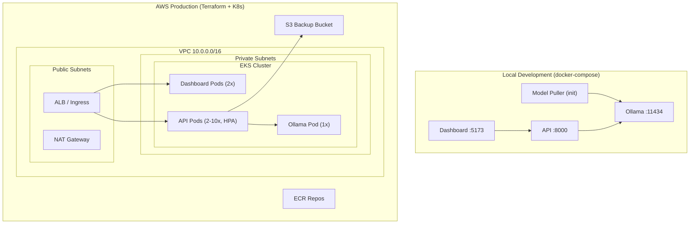

# ContextOS — DevOps Infrastructure Walkthrough

## Files Created (15 total)

### Docker (4 files)
| File | Purpose |
|------|---------|
| [Dockerfile](file:///c:/Users/niran/Documents/contextos/Dockerfile) | Multi-stage build for the Python API (builder + runtime) |
| [.dockerignore](file:///c:/Users/niran/Documents/contextos/.dockerignore) | Excludes .venv, .git, secrets, tests from build context |
| [docker-compose.yml](file:///c:/Users/niran/Documents/contextos/docker-compose.yml) | Local stack: Ollama + API + Dashboard + model puller |
| [dashboard/Dockerfile](file:///c:/Users/niran/Documents/contextos/dashboard/Dockerfile) | Multi-stage build: Node/Vite → nginx serving static files |

### Dashboard Infra (1 file)
| File | Purpose |
|------|---------|
| [dashboard/nginx.conf](file:///c:/Users/niran/Documents/contextos/dashboard/nginx.conf) | SPA fallback, `/api` reverse proxy, gzip, caching headers |

### Kubernetes (7 files)
| File | Purpose |
|------|---------|
| [k8s/namespace.yaml](file:///c:/Users/niran/Documents/contextos/k8s/namespace.yaml) | `contextos` namespace for resource isolation |
| [k8s/configmap.yaml](file:///c:/Users/niran/Documents/contextos/k8s/configmap.yaml) | Non-secret env vars (model names, hosts, ports) |
| [k8s/secret.yaml](file:///c:/Users/niran/Documents/contextos/k8s/secret.yaml) | Secret template with base64 placeholders |
| [k8s/ollama-deployment.yaml](file:///c:/Users/niran/Documents/contextos/k8s/ollama-deployment.yaml) | Ollama deployment (1 replica) + PVC + Service + init Job |
| [k8s/api-deployment.yaml](file:///c:/Users/niran/Documents/contextos/k8s/api-deployment.yaml) | API deployment (2 replicas) + PVC + Service + PDB |
| [k8s/dashboard-deployment.yaml](file:///c:/Users/niran/Documents/contextos/k8s/dashboard-deployment.yaml) | Dashboard deployment (2 replicas) + Service + Ingress with TLS |
| [k8s/hpa.yaml](file:///c:/Users/niran/Documents/contextos/k8s/hpa.yaml) | Auto-scales API from 2→10 pods based on CPU/memory |

### Terraform (3 files)
| File | Purpose |
|------|---------|
| [terraform/main.tf](file:///c:/Users/niran/Documents/contextos/terraform/main.tf) | VPC, EKS cluster, ECR repos, S3 backup bucket, IAM roles |
| [terraform/variables.tf](file:///c:/Users/niran/Documents/contextos/terraform/variables.tf) | Parameterized inputs with validation (region, instance type, etc.) |
| [terraform/outputs.tf](file:///c:/Users/niran/Documents/contextos/terraform/outputs.tf) | Prints cluster endpoint, ECR URLs, kubectl config command |

### CI/CD (2 files)
| File | Purpose |
|------|---------|
| [Jenkinsfile](file:///c:/Users/niran/Documents/contextos/Jenkinsfile) | 9-stage pipeline: test → lint → build → scan → push → deploy → verify |
| [.github/workflows/ci.yml](file:///c:/Users/niran/Documents/contextos/.github/workflows/ci.yml) | GitHub Actions alternative with the same stages |

### Modified Files
| File | Change |
|------|--------|
| [Makefile](file:///c:/Users/niran/Documents/contextos/Makefile) | Added 11 new targets (`docker-*`, `terraform-*`, `k8s-*`) |
| [.gitignore](file:///c:/Users/niran/Documents/contextos/.gitignore) | Added Terraform state, Docker, secrets, and Trivy report ignores |

---

## Architecture



---

## Deployment Commands

### A. Run Everything Locally with Docker Compose

```bash
# 1. Create a secrets directory (for Google OAuth, if needed)
mkdir -p secrets

# 2. Build both Docker images
make docker-build

# 3. Start the entire stack (Ollama + API + Dashboard)
make docker-run

# 4. Watch the logs (Ctrl+C to stop watching, containers keep running)
make docker-logs

# 5. Verify everything is working
make docker-test

# 6. Access the application
#    Dashboard: http://localhost:5173
#    API:       http://localhost:8000
#    Ollama:    http://localhost:11434

# 7. Stop everything
make docker-stop
```

### B. Deploy to AWS with Terraform + kubectl

```bash
# 1. Initialize Terraform (downloads AWS provider)
make terraform-init

# 2. Preview what will be created (review before applying!)
make terraform-plan

# 3. Create all AWS resources (~15-20 minutes for EKS)
make terraform-apply

# 4. Configure kubectl to connect to the new EKS cluster
aws eks update-kubeconfig --region us-east-1 --name contextos-cluster

# 5. Push Docker images to ECR
#    Get the ECR URL from Terraform output
ECR_URL=$(cd terraform && terraform output -raw ecr_api_url)

#    Login to ECR
aws ecr get-login-password --region us-east-1 | docker login --username AWS --password-stdin $ECR_URL

#    Tag and push
docker tag contextos-api:latest $ECR_URL:latest
docker push $ECR_URL:latest

ECR_DASH=$(cd terraform && terraform output -raw ecr_dashboard_url)
docker tag contextos-dashboard:latest $ECR_DASH:latest
docker push $ECR_DASH:latest

# 6. Update image references in k8s manifests
#    Replace YOUR_REGISTRY with your actual ECR URL in:
#    - k8s/api-deployment.yaml
#    - k8s/dashboard-deployment.yaml

# 7. Deploy to Kubernetes
make k8s-deploy

# 8. Check status
make k8s-status

# 9. Follow API logs
make k8s-logs
```

### C. Set Up Jenkins

```bash
# 1. Run Jenkins in Docker
docker run -d \
  --name jenkins \
  -p 8080:8080 \
  -p 50000:50000 \
  -v jenkins_home:/var/jenkins_home \
  -v /var/run/docker.sock:/var/run/docker.sock \
  jenkins/jenkins:lts

# 2. Get the initial admin password
docker exec jenkins cat /var/jenkins_home/secrets/initialAdminPassword

# 3. Open http://localhost:8080 and complete setup

# 4. Install required plugins:
#    - Docker Pipeline
#    - Pipeline: AWS Steps
#    - Coverage
#    - Slack Notification (optional)

# 5. Add credentials in Jenkins (Manage Jenkins → Credentials):
#    - 'ecr-registry-url': Your ECR registry URL
#    - AWS access key + secret key

# 6. Create a new Pipeline job pointing to your repo's Jenkinsfile
```

> [!IMPORTANT]
> Before deploying to production, replace these placeholders:
> - `YOUR_REGISTRY` in k8s deployment files → your actual ECR URL
> - `contextos.yourdomain.com` in Ingress and Jenkinsfile → your actual domain
> - Secret values in `k8s/secret.yaml` → real base64-encoded secrets
